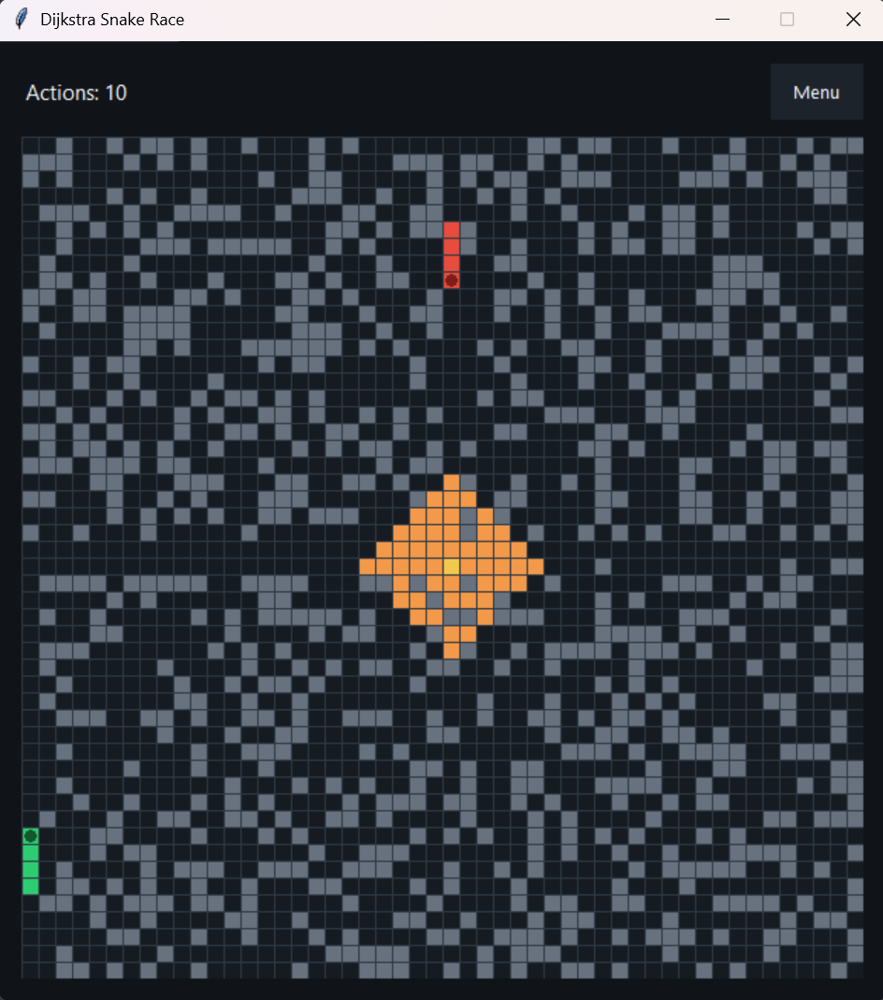

#   EF234405_DAA_Q2
## Dijkstra Snake Race: A Simple Snake Game with Adaptive Path Planning

### Gameplay

Two snake racing into the center of the maze. The player must let the green snake reach the center before the red snake. To do this, the player can create or break existing walls to make new path and the snake would recalculate and follow the new shortest path

### How to run
Clone the repository, then run `python main.py`